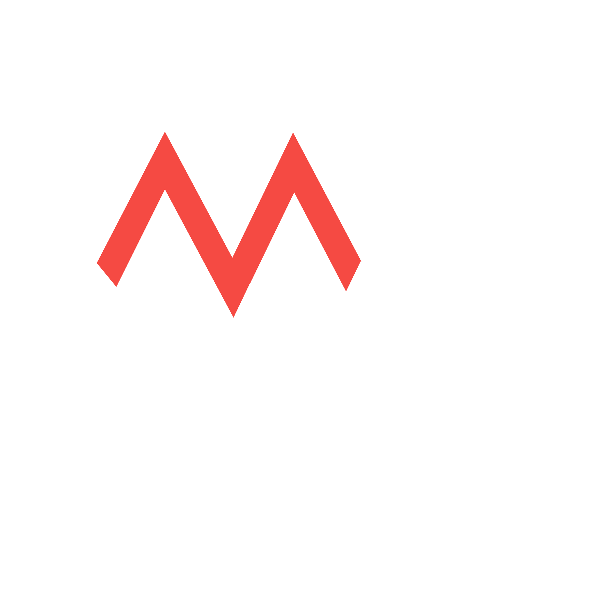

# MilosWeb

Welcome to my personal website, im a software deverloper. The website serves as a portfolio and a place to showcase projects.

## Brand



MilosWorks is my personal brand.

## Technologies Used

### Runtime


### Language


### Web Framework


### Styling


### Linting and Formatting


### UI Components


## Getting Started

To get started with the project, you will need to have Bun installed on your machine. You can find the installation instructions [here](https://bun.sh/docs/installation).

Once you have Bun installed, you can follow these steps to get the project up and running:

1.  **Clone the repository:**

    ```bash
    git clone https://github.com/milosworks/milosweb.git
    ```

2.  **Install the dependencies:**

    ```bash
    bun install
    ```

3.  **Set up the environment variables:**

    Create a `.env` file in the root of the project by copying the `.env.example` file and then fill in the required values.

    ```bash
    cp .env.example .env
    ```

4.  **Start the development server:**

    ```bash
    bun dev
    ```

The application will be available at `http://localhost:3000`.

## Deployment

This project can be deployed using Docker or Podman.


To build and run the application in a container, you can use a `Dockerfile` and `docker-compose.yml`.

## Fonts

This project uses the following fonts:

-   **Rubik**: Licensed under the SIL Open Font License, Version 1.1.
-   **Space Grotesk**: Licensed under the SIL Open Font License, Version 1.1.

## License

The code in this project is licensed under the MIT License. See the [LICENSE](LICENSE) file for more details.

The brand assets (logo and name) are licensed under the [Creative Commons Attribution-NonCommercial 4.0 International License](http://creativecommons.org/licenses/by-nc/4.0/).
